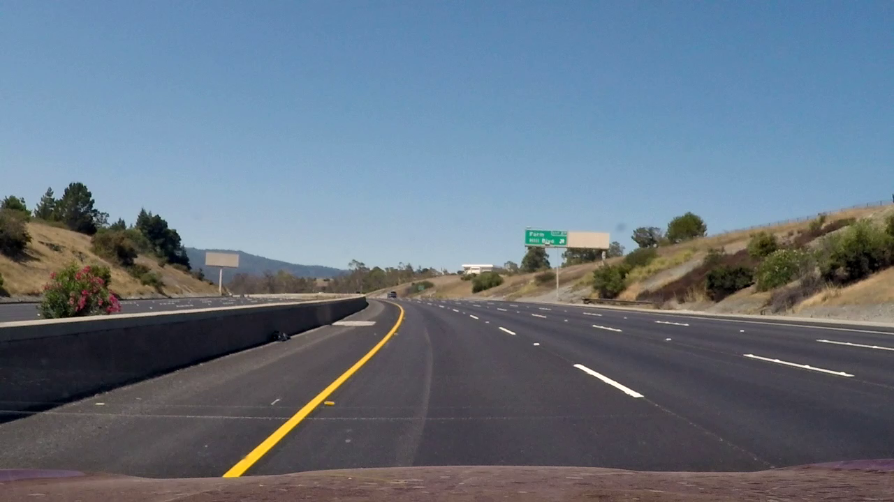
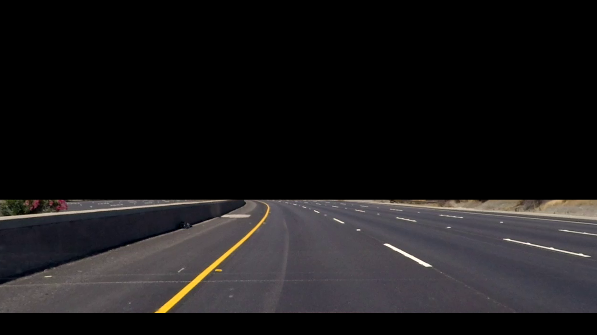
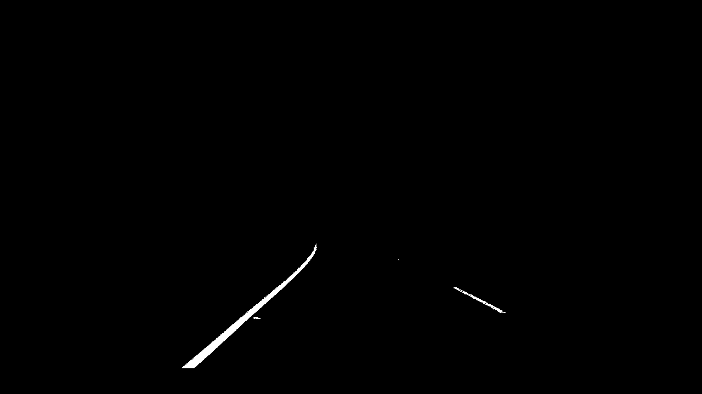
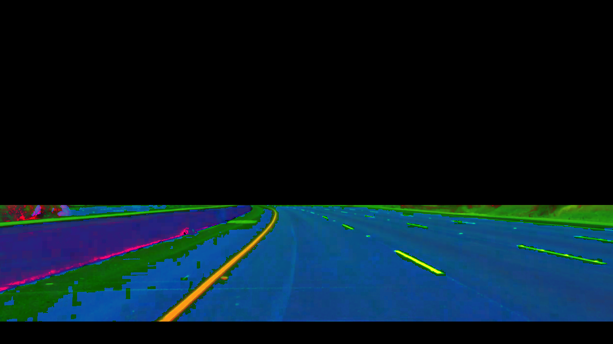

# Lane Detection System
[](https://travis-ci.org/rohithjayarajan/LaneDetectionSystem)
[](https://coveralls.io/github/rohithjayarajan/LaneDetectionSystem?branch=master)
[](https://opensource.org/licenses/MIT)

---

## Overview

Project to design a system for lane departure warning system for self-driving cars which include lane detection and steer prediction. In this project, a monocular camera installed on the self driving vehicle serves as the input for the lane detecton system pipeline. After preprocessing of image frame, the segmented two lanes are used to fit curves describing the traffic lanes. Also this information is used to predict the steering angle of the vehicle. 
A C++ project with:

- cmake
- googletest
- OpenCV

## License
```
MIT License

Copyright (c) 2018 Rohith Jayarajan, Akash Guha

Permission is hereby granted, free of charge, to any person obtaining a copy of 
this software and associated documentation files (the "Software"), to deal in 
the Software without restriction, including without limitation the rights to 
use, copy, modify, merge, publish, distribute, sublicense, and/or sell copies 
of the Software, and to permit persons to whom the Software is furnished to do 
so, subject to the following conditions:

The above copyright notice and this permission notice shall be included in all 
copies or substantial portions of the Software.

THE SOFTWARE IS PROVIDED "AS IS", WITHOUT WARRANTY OF ANY KIND, EXPRESS OR IMPLIED, 
INCLUDING BUT NOT LIMITED TO THE WARRANTIES OF MERCHANTABILITY, FITNESS FOR A PARTICULAR 
PURPOSE AND NONINFRINGEMENT. IN NO EVENT SHALL THE AUTHORS OR COPYRIGHT HOLDERS BE LIABLE 
FOR ANY CLAIM, DAMAGES OR OTHER LIABILITY, WHETHER IN AN ACTION OF CONTRACT, TORT OR 
OTHERWISE, ARISING FROM, OUT OF OR IN CONNECTION WITH THE SOFTWARE OR THE USE OR OTHER 
DEALINGS IN THE SOFTWARE.
```
## Algorithm Pipeline

Aim of the project is to formulate a software pipeline to identify white/yellow lanes on the road and predict the steering angle for autonomous vehicles.

The video input is from a fixed front facing camera installed on top of the vehicle/car. The camera’s intrinsic parameters and the distortion coefficients for the given dataset was provided.



As no camera is perfect, the distortions in the camera lens modifies the captured image, therefore the camera intrinsic parameters and distortion coefficients are used to un-distort the image frames before carrying out any further processing. A gaussian filter is used to smooth the image frame and reduce the noise content in it.

 A region of interest is extracted by eliminating the upper half of the image, as it is obvious that the lanes are present only in the lower half. Also extracting an ROI as part of the pre-processing step helps in reducing computation to a great extent in later steps.
 
 

Following the initial preprocessing of the image frames, thresholding technique in both RGB and HLS color spaces were tried, to get the binary image showing just the lane pixels. As HLS color space is more immune to variations in illumination/external lighting, it gives a better result. Finding the optimal threshold values for hue, saturation and luminescence is the most time consuming process in this phase.



The received binary image consisting of the lanes, is then transformed (perspective transformation) to obtain a top view. This allows to fit a curve on the lane pixels as they were projected onto a 2D surface.


The next step is to fit a second degree polynomial onto the left and right lane pixels. A histogram is generated representing the pixel count along the y-axis while we sweep across the width of the image. The two highest peaks in the histogram will likely be the x location for the base of the lane lines.



Two sliding windows representing the left and right lanes are aligned with the lane centers at the base of the image frame, these windows then track the lanes up to the top of the frame.

On getting the fitted lane pixels, the same is plotted on the image and the turn angle is computed.

The last step is to warp the lane boundaries back onto the original image by inverse perspective transformation.    

## Dependencies

- [OpenCV][reference-id-for-OpenCV]: An Open Source Computer Vision Library released under a BSD license.
A complete installation guide for OpenCV can be found [here][reference-id-for-here].

[reference-id-for-OpenCV]: https://opencv.org/
[reference-id-for-here]: https://docs.opencv.org/3.3.1/d7/d9f/tutorial_linux_install.html

## Solo Iterative Process

SIP is a software process that single programmers use while working on a software project. The solo programmer who is the hero of this process is named “Sol”. Sol receives the requirements from the users and records them in the product backlog. From the iteration backlog, Sol selects a specific change request and implements the corresponding software changes. Product Backlog, Work Log and Iteration Backlog for this project can be found [here][reference-id-for-here1].

[reference-id-for-here1]: https://docs.google.com/spreadsheets/d/1b254fKUI1N3dCOtlsByfg0JyH0NWnpPUUpDtdTfVFeI/edit?usp=sharing

## Standard install via command-line
```
git clone --recursive https://github.com/rohithjayarajan/LaneDetectionSystem
cd <path to repository>
mkdir build
cd build
cmake ..
make
Run tests: ./test/cpp-test
Run program: ./app/shell-app
```

## Building for code coverage
```
sudo apt-get install lcov
cmake -D COVERAGE=ON -D CMAKE_BUILD_TYPE=Debug ../
make
make code_coverage
```
This generates a index.html page in the build/coverage sub-directory that can be viewed locally in a web browser.

## Working with Eclipse IDE ##

## Installation

In your Eclipse workspace directory (or create a new one), checkout the repo (and submodules)
```
mkdir -p ~/workspace
cd ~/workspace
git clone --recursive https://github.com/rohithjayarajan/LaneDetectionSystem
```

In your work directory, use cmake to create an Eclipse project for an [out-of-source build] of LaneDetectionSystem

```
cd ~/workspace
mkdir -p LaneDetectionSystem-eclipse
cd LaneDetectionSystem-eclipse
cmake -G "Eclipse CDT4 - Unix Makefiles" -D CMAKE_BUILD_TYPE=Debug -D CMAKE_ECLIPSE_VERSION=4.7.0 -D CMAKE_CXX_COMPILER_ARG1=-std=c++14 ../LaneDetectionSystem/
```

## Import

Open Eclipse, go to File -> Import -> General -> Existing Projects into Workspace -> 
Select "LaneDetectionSystem-eclipse" directory created previously as root directory -> Finish

# Edit

Source files may be edited under the "[Source Directory]" label in the Project Explorer.


## Build

To build the project, in Eclipse, unfold LaneDetectionSystem-eclipse project in Project Explorer,unfold Build Targets, double click on "all" to build all projects.

## Run

1. In Eclipse, right click on the LaneDetectionSystem-eclipse in Project Explorer,
select Run As -> Local C/C++ Application

2. Choose the binaries to run (e.g. shell-app, cpp-test for unit testing)


## Debug


1. Set breakpoint in source file (i.e. double click in the left margin on the line you want 
the program to break).

2. In Eclipse, right click on the LaneDetectionSystem-eclipse in Project Explorer, select Debug As -> 
Local C/C++ Application, choose the binaries to run (e.g. shell-app).

3. If prompt to "Confirm Perspective Switch", select yes.

4. Program will break at the breakpoint you set.

5. Press Step Into (F5), Step Over (F6), Step Return (F7) to step/debug your program.

6. Right click on the variable in editor to add watch expression to watch the variable in 
debugger window.

7. Press Terminate icon to terminate debugging and press C/C++ icon to switch back to C/C++ 
perspetive view (or Windows->Perspective->Open Perspective->C/C++).


## Plugins

- CppChEclipse

    To install and run cppcheck in Eclipse

    1. In Eclipse, go to Window -> Preferences -> C/C++ -> cppcheclipse.
    Set cppcheck binary path to "/usr/bin/cppcheck".

    2. To run CPPCheck on a project, right click on the project name in the Project Explorer 
    and choose cppcheck -> Run cppcheck.


- Google C++ Sytle

    To include and use Google C++ Style formatter in Eclipse

    1. In Eclipse, go to Window -> Preferences -> C/C++ -> Code Style -> Formatter. 
    Import [eclipse-cpp-google-style][reference-id-for-eclipse-cpp-google-style] and apply.

    2. To use Google C++ style formatter, right click on the source code or folder in 
    Project Explorer and choose Source -> Format

[reference-id-for-eclipse-cpp-google-style]: https://raw.githubusercontent.com/google/styleguide/gh-pages/eclipse-cpp-google-style.xml

- Git

    It is possible to manage version control through Eclipse and the git plugin, but it typically requires creating another project. If you're interested in this, try it out yourself and contact me on Canvas.
    
## Doxygen Documentation

To generate Doxygen Documentation,
```
cd <path to repository>
mkdir <documentation_folder_name>
cd <documentation_folder_name>
doxygen -g <config_file_name>

```
Update PROJECT_NAME and INPUT fields in the configuration file.

Then run the following command to generate the documentations,
```
doxygen <config_file_name>
```
